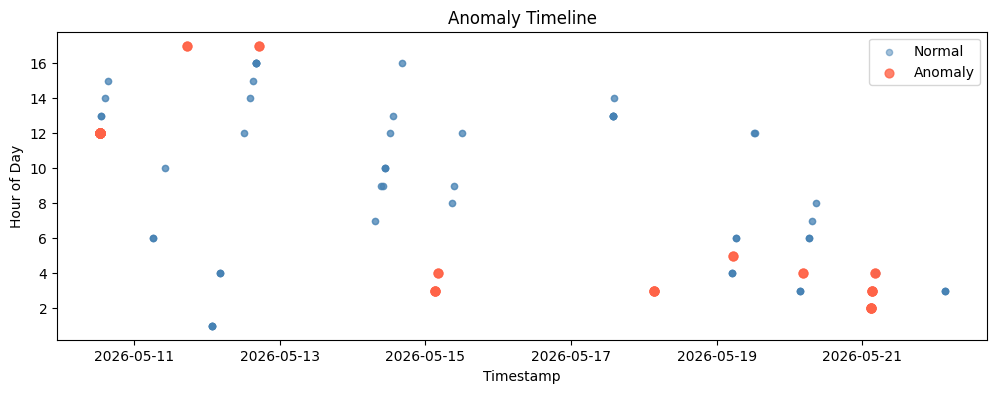
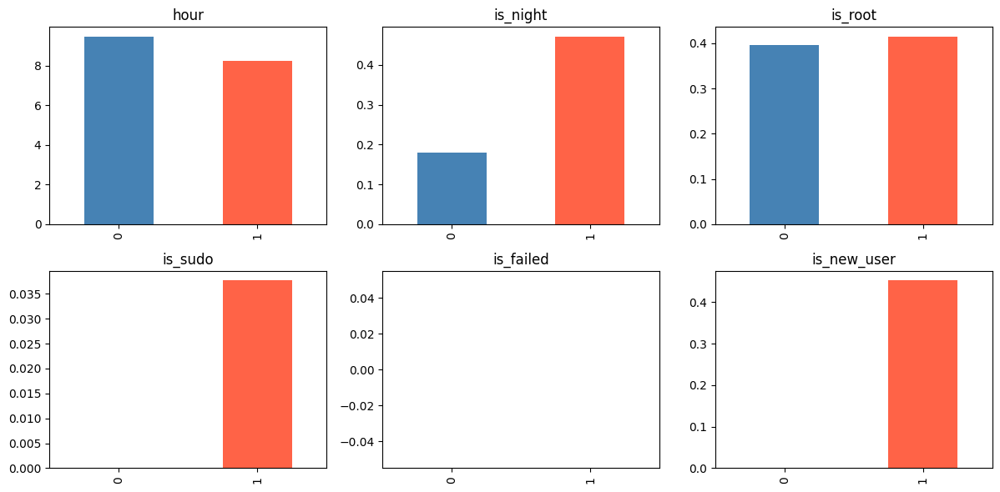

# Log Anomaly Detector
A hybrid anomaly detection system that parses real Linux auth logs and flags suspicious activity using rule-based detection combined with Isolation Forest ML model.

## Features
- Parses real Linux auth.log into structured DataFrame
- Engineers security features: night logins, root access, sudo usage, user modifications
- Rule engine detects known attack patterns (brute force, privilege escalation)
- Isolation Forest flags statistical outliers rules might miss
- Hybrid detector combines both for higher coverage
- Severity-ranked alert CSV output (HIGH/MEDIUM/LOW)

## Language
Python 3

## Libraries Used
- pandas, numpy
- scikit-learn
- matplotlib
- re, datetime

## Installation
```bash
git clone https://github.com/rmp7439/log-anomaly-detector
cd log-anomaly-detector
pip install -r requirements.txt
```

## Usage
```bash
jupyter lab detector.ipynb
```

## Project Structure
```
log-anomaly-detector/
├── detector.ipynb
├── results/
│   ├── alerts.csv
│   ├── anomaly_timeline.png
│   └── feature_distribution.png
├── .gitignore
└── README.md
```

## Results
| Detector | Anomalies Flagged |
|----------|------------------|
| Rule Engine | 44 |
| Isolation Forest | 13 |
| Hybrid | 53 |

| Severity | Count |
|----------|-------|
| HIGH | 4 |
| MEDIUM | 40 |
| LOW | 9 |




## Future Improvements
- Add Streamlit dashboard for real-time monitoring
- LSTM Autoencoder for sequence-based anomaly detection
- Support for multiple log formats (nginx, syslog, Windows Event logs)
- Email/Slack alerting when HIGH severity event detected